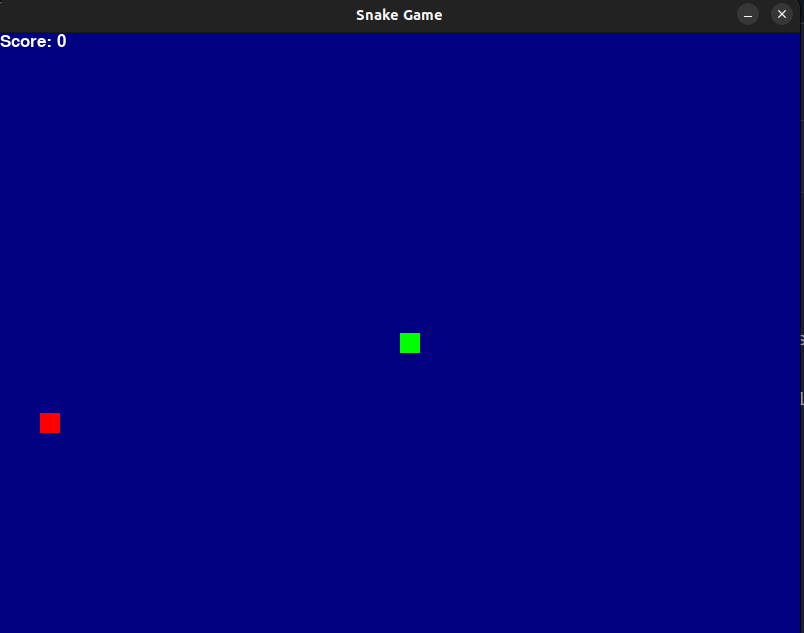

# snake_game_ai

> This project was created utilising chatgpt ai prompts to create Python code for a snake game.
> Utilised chatgpt4 by iterating through many prompts to produce clean and functional code to enable a fully functioning snake game.
>
> Overview:
> A basic snake game has been created which includes a dynamic scoring system, snake size and colouring.
> The user starts the game and aims to gain points by controlling the snake to eat the food without touching the sides of the game.
> The game finishes if the side is touched and there is an option to play again or quit.
> More features will be added in the future.
> 
> The screenshot below shows an example of the game board : 
>
> 
